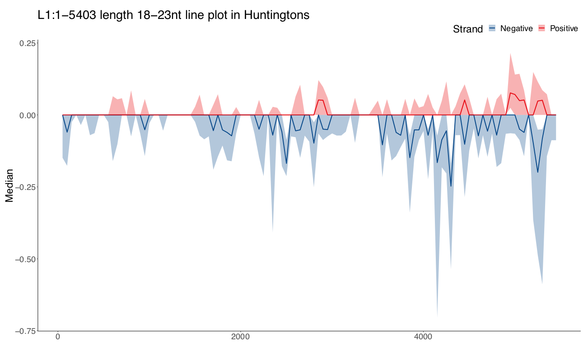

# Instructions

## Prerequisite

When running on SCC, load the R module version 3.5.2

```
module load R/3.5.2
```

## Input format

Input should be a csv file that contains 4 columns:

+ TE: The full name of the TE, such as **ALU:1-312**.
+ Sample: Sample's name, such as **C_0002**.
+ Status: Sample's status, such as **Huntingtons** or **Control**.
+ Path: the absolute path of the TPM file of the TE in that sample, such as **/projectnb/lau-bumc/qichengm/projects/Lau_lab/human/HD_PD_project/miRNA/C_0002_TE/TE@ALU:1-312**.

The first three columns data could be generated via the Path column data.

For the current data provided in the `HD_PD_project/miRNA` folder, a file with all of the data will be provided. When doing analysis on specific samples/TE, filtering/selecting could be done to retrieve the data in need.

## Quick start

In the same folder where the script `TE_viz_line_plot.R` resides, run
```
./TE_viz_line_plot.R ../data/testing_TE.csv  ../figs
```
assuming the input file is called `testing_TE.csv` in a parallel folder named `data`, and the output directory is another parallel folder called `figs`.

If the folder does not exist, the script will create one.

## Help message

When running 
```
./TE_viz_line_plot.R -h
```
a help message will display on the screen, which says
```
Plot TPM distribution in the bins from the TE alignment data in different groups of samples.
Usage:
  TE_viz_line_plot.R <input_fn> <output_dir>

Options:
  -h --help  Show this screen.
  -v --version  Show version.

Arguments:
  input_fn  The absolute or relative path of the input file. Please see the READ.md for more details of the format of the file.
  output_dir  Output directory path either absolute or relative, for example "../figs" 
```

## Example plot



An example output plot is shown above, with the file name exactly the same as the figure title. The figure is in the pdf format. 

For a given TE, there will be three separate plots corresponding to three different lengths: 18-23nt, 24-35nt and any length for each of the conditions which include Control, Huntingtons and Parkinsons, depending on what data is in the input file.

This information is summarised in the figure title and file name as well. For instance, one output figure named `L1:1-5403 any length line plot in Control.pdf` points out that this is a line plot with the reads of any lengths in the Control samples for the TE L1:1-5403. 

In the example plot, two lines are drawn to showcase the median of the TPM data from all of the selected samples in each bin, with red line representing alignment to the positive strand and blue the negative strand. The shaded area indicates the interquartile range in each group.


